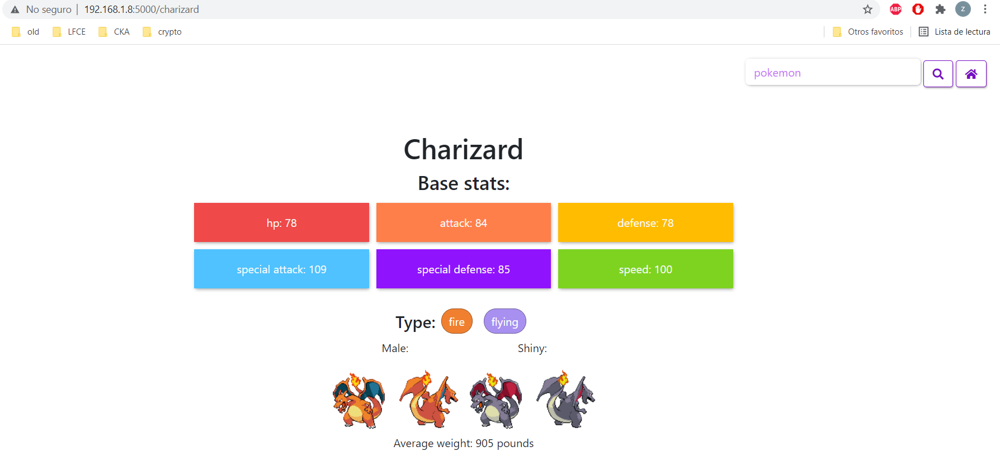

# Pokedex, version flask

Pokedex hecha en flask utilizando la API de pokeapi para obtener informacion de distintos pokemones utilizando el buscador o seleccionadolo desde el homepage. 

## Creacion de la Imagen de nuestra aplicacion

1. Si bien nuestra imagen ya esta construida y subida a dockerhub, tambien proveemos en el repo el archivo dockerfile para realizarle modificaciones encima y construir una nueva imagen a su gusto. 

```bash
docker build . -t zhraste/pokedex-flask .
```

2. En caso de que quieran subir su imagen a dockerhub, pueden hacerlo mediante el comando docker push

```bash
docker push zhraste/pokedex-flask
```
NOTA: Es importante que antes de hacer el push nos loguiemos a nuestra cuenta de docker hub con el comando docker login

## Creacion de directorios para los volumenes 
 Una vez lista la imagen, necesitaremos 2 volumenes para este proyecto. En 1 tendremos nuestros archivos estaticos, principalmente archivos de diseño para css como los colores de los tipos de los pokemones por ejemplo. Mientras que en el otro tendremos los archivos html que seran la estructura de la pagina. 

1. Primero crearemos los directorios: 

```bash
sudo mkdir /var/flask/pokedex/templates
sudo mkdir /var/flask/pokedex/static
```
2. Luego copiaremos los archivos de este repositorio hacia esos directorios locales (estos archivos luego seran utilizados por los pods)

```bash
sudo cp Docker/templates/* /var/flask/pokedex/templates
sudo cp Docker/static/* /var/flask/pokedex/static
```
3. Una vez listos nuestro directorios locales aplicaremos los distintos archivos yaml para crear los volumenes, empezando por los pv y siguiendo por los claim

```bash
kubectl apply -f Kubernetes/static-pv.yaml
kubectl apply -f Kubernetes/templates-pv.yaml
kubectl apply -f Kubernetes/static-claim.yaml
kubectl apply -f Kubernetes/templates-claim.yaml
```

4. Ya creados los volumenes podremos aplicar el archivo del deployment, esto puede tardar un poco ya que tendra que hacer un pull de la imagen:

```bash
kubectl apply -f Kubernetes/pokedex-deployment.yaml
```

5. Por ultimo, crearemos un proxy para poder acceder a los pods desde la IP o DNS de nuestra virtual.

```bash
kubectl port-forward deployment/pokedex-deployment 5000:5000 --address 0.0.0.0
```
6. Y listo, ya tendremos nuestro servicio corriendo en 1 pod y siendo accesible desde la IP de la maquina virtual 


